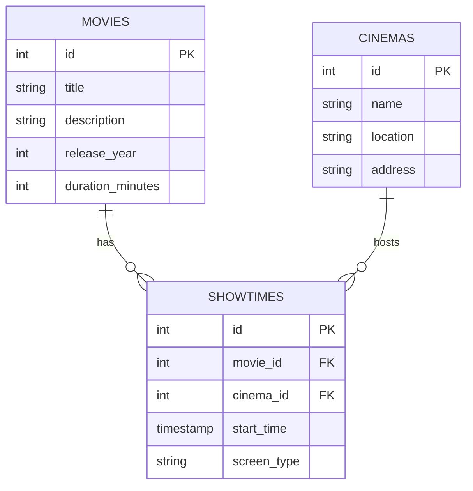

## Overview

Showtimes NG uses **Supabase** (PostgreSQL) as its database. The schema consists of three main tables: `movies`, `cinemas`, and `showtimes`.

## Database Tables

### Movies Table

Stores information about movies currently showing or scheduled to show.

<ParamField path="id" type="number" required>
  Primary key, auto-incrementing integer
</ParamField>

<ParamField path="title" type="string" required>
  Movie title
</ParamField>

<ParamField path="description" type="string | null">
  Movie plot or description
</ParamField>

<ParamField path="release_year" type="number | null">
  Year the movie was released
</ParamField>

<ParamField path="duration_minutes" type="number | null">
  Movie runtime in minutes
</ParamField>

<ParamField path="rating" type="number | null">
  Movie rating (e.g., IMDb rating)
</ParamField>

<ParamField path="poster_url" type="string | null">
  URL to movie poster image
</ParamField>

<ParamField path="metacritic_rating" type="number | null">
  Metacritic score (0-100)
</ParamField>

<ParamField path="rotten_tomatoes_rating" type="number | null">
  Rotten Tomatoes score (0-100)
</ParamField>

<ParamField path="created_at" type="string" required>
  ISO timestamp when record was created
</ParamField>

<ParamField path="updated_at" type="string" required>
  ISO timestamp when record was last updated
</ParamField>

### Cinemas Table

Stores information about cinema locations across Lagos.

<ParamField path="id" type="number" required>
  Primary key, auto-incrementing integer
</ParamField>

<ParamField path="name" type="string" required>
  Cinema name (e.g., "Filmhouse IMAX Lekki")
</ParamField>

<ParamField path="location" type="string | null">
  Short location identifier (e.g., "Lekki", "VI")
</ParamField>

<ParamField path="verbose_location" type="string | null">
  Full location name (e.g., "Victoria Island")
</ParamField>

<ParamField path="address" type="string | null">
  Full street address
</ParamField>

<ParamField path="created_at" type="string" required>
  ISO timestamp when record was created
</ParamField>

<ParamField path="updated_at" type="string" required>
  ISO timestamp when record was last updated
</ParamField>

### Showtimes Table

Stores individual movie showings at specific cinemas.

<ParamField path="id" type="number" required>
  Primary key, auto-incrementing integer
</ParamField>

<ParamField path="movie_id" type="number" required>
  Foreign key referencing `movies.id`
</ParamField>

<ParamField path="cinema_id" type="number" required>
  Foreign key referencing `cinemas.id`
</ParamField>

<ParamField path="start_time" type="string" required>
  ISO timestamp when the movie showing starts
</ParamField>

<ParamField path="screen_type" type="string" required>
  Type of screen (e.g., "IMAX", "Standard", "3D", "VIP")
</ParamField>

<ParamField path="movie_url" type="string | null">
  Link to cinema's booking page for this showing
</ParamField>

<ParamField path="created_at" type="string" required>
  ISO timestamp when record was created
</ParamField>

<ParamField path="updated_at" type="string" required>
  ISO timestamp when record was last updated
</ParamField>

## TypeScript Types

The database schema is represented by TypeScript interfaces in `src/lib/queries.ts`:

<CodeGroup>
```typescript Movie
export interface Movie {
  id: number;
  title: string;
  description: string | null;
  release_year: number | null;
  duration_minutes: number | null;
  rating: number | null;
  poster_url: string | null;
  metacritic_rating: number | null;
  rotten_tomatoes_rating: number | null;
  created_at: string;
  updated_at: string;
}
```

```typescript Cinema
export interface Cinema {
  id: number;
  name: string;
  location: string | null;
  verbose_location: string | null;
  address: string | null;
  created_at: string;
  updated_at: string;
}
```

```typescript Showtime
export interface Showtime {
  id: number;
  movie_id: number;
  cinema_id: number;
  start_time: string; // DateTime stored as ISO string
  screen_type: string;
  movie_url: string | null; // Link to cinema's booking page
  created_at: string;
  updated_at: string;
}
```
</CodeGroup>

## Database Queries

The application uses Supabase's JavaScript client for all database operations. Key query functions are defined in `src/lib/queries.ts`.

### Movie Queries

#### Get Now Showing Movies

Returns all movies with at least one future showtime, sorted by earliest showtime:

```typescript
export async function getNowShowingMovies() {
  const now = new Date().toISOString();

  const { data, error } = await supabase
    .from('movies')
    .select(`
      *,
      showtimes!inner(id, start_time)
    `)
    .gte('showtimes.start_time', now);

  if (error) throw error;
  return data as Movie[];
}
```

<Note>
  The `!inner` modifier performs an inner join, ensuring only movies with matching showtimes are returned.
</Note>

#### Get All Movies

```typescript
export async function getAllMovies() {
  const { data, error } = await supabase
    .from('movies')
    .select('*')
    .order('title');

  if (error) throw error;
  return data as Movie[];
}
```

#### Get Movie by ID

```typescript
export async function getMovieById(id: number) {
  const { data, error } = await supabase
    .from('movies')
    .select('*')
    .eq('id', id)
    .single();

  if (error) throw error;
  return data as Movie;
}
```

### Cinema Queries

#### Get All Cinemas

```typescript
export async function getCinemas() {
  const { data, error } = await supabase
    .from('cinemas')
    .select('*')
    .order('name');

  if (error) throw error;
  return data as Cinema[];
}
```

#### Get Cinema by ID

```typescript
export async function getCinemaById(id: number) {
  const { data, error } = await supabase
    .from('cinemas')
    .select('*')
    .eq('id', id)
    .single();

  if (error) throw error;
  return data as Cinema;
}
```

### Showtime Queries

#### Get Showtimes for Movie

Returns all future showtimes for a specific movie, with cinema information:

```typescript
export async function getShowtimesForMovie(movieId: number) {
  const now = new Date().toISOString();

  const { data, error } = await supabase
    .from('showtimes')
    .select(`
      *,
      cinema:cinemas(*)
    `)
    .eq('movie_id', movieId)
    .gte('start_time', now)
    .order('start_time');

  if (error) throw error;
  return data;
}
```

#### Get Showtimes for Cinema

Returns all future showtimes at a specific cinema, with movie information:

```typescript
export async function getShowtimesForCinema(cinemaId: number) {
  const now = new Date().toISOString();

  const { data, error } = await supabase
    .from('showtimes')
    .select(`
      *,
      movie:movies(*)
    `)
    .eq('cinema_id', cinemaId)
    .gte('start_time', now)
    .order('start_time');

  if (error) throw error;
  return data;
}
```

## Helper Functions

### Generate Slug

Converts text to URL-friendly slugs:

```typescript
export function generateSlug(text: string): string {
  return text
    .toLowerCase()
    .replace(/[^a-z0-9]+/g, '-')
    .replace(/(^-|-$)/g, '');
}
```

**Example:**
```typescript
generateSlug("The Dark Knight") // "the-dark-knight"
generateSlug("Mission: Impossible") // "mission-impossible"
```

### Get Display Location

Returns the verbose location if available, otherwise falls back to the short location:

```typescript
export function getDisplayLocation(cinema: Cinema): string | null {
  return cinema.verbose_location || cinema.location;
}
```

## Creating the Schema

To create the database schema in your Supabase project:

<Steps>
  <Step title="Open Supabase SQL Editor">
    Navigate to your Supabase project dashboard and open the **SQL Editor**.
  </Step>

  <Step title="Create movies table">
    ```sql
    CREATE TABLE movies (
      id SERIAL PRIMARY KEY,
      title TEXT NOT NULL,
      description TEXT,
      release_year INTEGER,
      duration_minutes INTEGER,
      rating NUMERIC,
      poster_url TEXT,
      metacritic_rating INTEGER,
      rotten_tomatoes_rating INTEGER,
      created_at TIMESTAMPTZ DEFAULT NOW(),
      updated_at TIMESTAMPTZ DEFAULT NOW()
    );
    ```
  </Step>

  <Step title="Create cinemas table">
    ```sql
    CREATE TABLE cinemas (
      id SERIAL PRIMARY KEY,
      name TEXT NOT NULL,
      location TEXT,
      verbose_location TEXT,
      address TEXT,
      created_at TIMESTAMPTZ DEFAULT NOW(),
      updated_at TIMESTAMPTZ DEFAULT NOW()
    );
    ```
  </Step>

  <Step title="Create showtimes table">
    ```sql
    CREATE TABLE showtimes (
      id SERIAL PRIMARY KEY,
      movie_id INTEGER NOT NULL REFERENCES movies(id) ON DELETE CASCADE,
      cinema_id INTEGER NOT NULL REFERENCES cinemas(id) ON DELETE CASCADE,
      start_time TIMESTAMPTZ NOT NULL,
      screen_type TEXT NOT NULL,
      movie_url TEXT,
      created_at TIMESTAMPTZ DEFAULT NOW(),
      updated_at TIMESTAMPTZ DEFAULT NOW()
    );
    ```
  </Step>

  <Step title="Create indexes">
    Add indexes for better query performance:

    ```sql
    CREATE INDEX idx_showtimes_movie_id ON showtimes(movie_id);
    CREATE INDEX idx_showtimes_cinema_id ON showtimes(cinema_id);
    CREATE INDEX idx_showtimes_start_time ON showtimes(start_time);
    ```
  </Step>

  <Step title="Enable Row Level Security (optional)">
    For public read access:

    ```sql
    ALTER TABLE movies ENABLE ROW LEVEL SECURITY;
    ALTER TABLE cinemas ENABLE ROW LEVEL SECURITY;
    ALTER TABLE showtimes ENABLE ROW LEVEL SECURITY;

    CREATE POLICY "Enable read access for all users" ON movies
      FOR SELECT USING (true);

    CREATE POLICY "Enable read access for all users" ON cinemas
      FOR SELECT USING (true);

    CREATE POLICY "Enable read access for all users" ON showtimes
      FOR SELECT USING (true);
    ```
  </Step>
</Steps>

<Warning>
  Remember to restrict write access appropriately in production. The above policies only enable read access for all users.
</Warning>

## Relationships



- One **movie** can have many **showtimes**
- One **cinema** can host many **showtimes**
- Each **showtime** belongs to one movie and one cinema